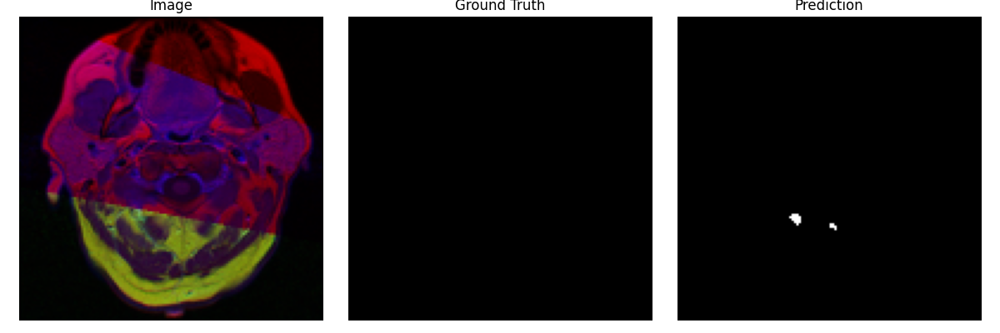

# Brain MRI Tumor Segmentation with U-Net

## 1. Project Overview

## 2. Dataset

## 3. Method

## 4. Training

## 5. Results

## 6. Limitations

## 7. Future Work

# Brain MRI Tumor Segmentation with U-Net

## 1. Project Overview
This project aims to segment tumor regions from Brain MRI images using a U-Net based deep learning model.

Medical image segmentation is a key task in healthcare AI, especially for tumor detection and treatment planning.

---

## 2. Dataset
- LGG MRI Segmentation Dataset (Kaggle)
- Total samples: 3929
- Input: Brain MRI image
- Target: Binary tumor mask

---

## 3. Method

### Model
- U-Net architecture
- Encoder-Decoder structure with skip connections

### Loss
- BCE + Dice Loss

### Metrics
- Dice Score
- IoU Score

### Preprocessing
- Resize: 128x128
- Normalization: [0, 1]
- Augmentation: Horizontal / Vertical flip

---

## 4. Training

- Epochs: 1 (baseline)
- Batch size: 8
- Optimizer: Adam
- Learning rate: 1e-3
- Device: CPU

---

## 5. Results

| Metric | Score |
|------|------|
| Dice | 0.4383 |
| IoU  | 0.4033 |

---

## 6. Prediction Examples

---

## 7. Key Learnings

- Implemented full medical image segmentation pipeline
- Understood class imbalance in segmentation tasks
- Compared Dice vs BCE loss behavior

---

## 8. Limitations

- Low resolution (128x128)
- Trained on CPU (limited epochs)
- 2D segmentation only

---

## 9. Future Work

- Train with higher resolution (256x256)
- Use GPU for longer training
- Try advanced architectures (UNet++, Attention U-Net)