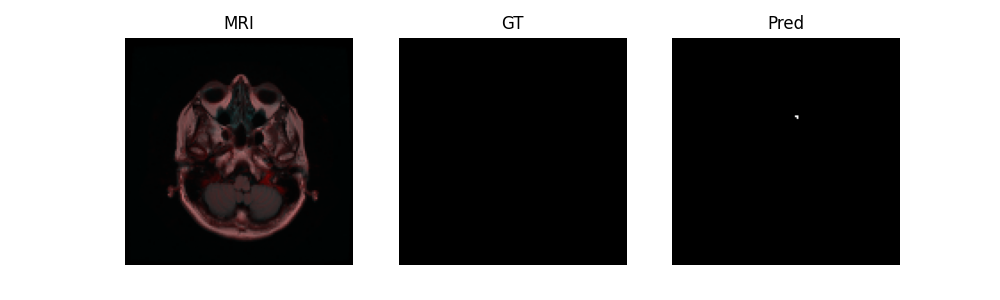

# Brain MRI Tumor Segmentation with U-Net

## 1. Project Overview

This project aims to segment brain tumor regions from MRI images using a U-Net based deep learning model.

Medical image segmentation is an important task in healthcare AI because it can support diagnosis, treatment planning, and tumor progression monitoring.

The main goal of this project was to build a complete medical image segmentation pipeline and improve it from a simple baseline experiment to a more reliable validation-based training setup.

---

## 2. Repository Structure

```text
.
├── train.py              # Training script
├── predict.py            # Prediction visualization script
├── src/
│   ├── dataset.py        # Dataset loading and preprocessing
│   ├── model.py          # U-Net model architecture
│   ├── losses.py         # BCE + Dice Loss
│   └── metrics.py        # Dice and IoU metrics
├── outputs/
│   ├── baseline/
│   │   └── predictions/  # 1-epoch baseline prediction examples
│   └── epoch5/
│       └── predictions/  # 5-epoch prediction examples
└── README.md
```

## 3. Dataset

Dataset: LGG MRI Segmentation Dataset
Total samples: 3,929
Input: Brain MRI image
Target: Binary tumor mask
Task: Binary semantic segmentation
Dataset Characteristics

This dataset has a class imbalance problem because tumor regions usually occupy a much smaller area than the background.
For this reason, Dice-based evaluation is important in addition to pixel-wise loss.


## 4. Method
Model: U-Net

U-Net was used because it is widely adopted for biomedical image segmentation.

The model uses an encoder-decoder structure:

Encoder extracts high-level image features
Decoder restores spatial resolution
Skip connections help preserve fine-grained spatial information

Skip connections are especially important in segmentation because tumor boundaries can be small and detailed.


## 5. Loss Function

The model was trained using BCE + Dice Loss.

BCE Loss provides pixel-wise supervision
Dice Loss directly optimizes overlap between the predicted mask and ground truth mask
Dice Loss helps reduce the effect of class imbalance

This combination is useful for medical segmentation tasks where the target region is relatively small.


## 6. Metrics

The model was evaluated using:

Dice Score
IoU Score

Dice Score measures the overlap between the predicted mask and the ground truth mask.
IoU is a stricter overlap-based metric.


## 7. Preprocessing and Training
Preprocessing
Resize: 128 × 128
Normalization: [0, 1]
Augmentation: Horizontal / Vertical flip for training data
Training Setup
Epochs: 5
Batch size: 8
Optimizer: Adam
Learning rate: 1e-3
Device: CPU
Train / Validation split: 80 / 20
Best model saved based on validation Dice Score


## 8. Results

### Experiment Comparison

| Experiment | Epochs | Val Dice | Val IoU |
|---|---:|---:|---:|
| Baseline | 1 | 0.4383 | 0.4033 |
| Improved Training | 5 | 0.6387 | 0.6010 |


### Training Log
Epoch	Train Loss	Val Loss	Val Dice	Val IoU
1	0.9386	0.9188	0.4896	0.4541
2	0.8396	0.8607	0.6232	0.5914
3	0.8131	0.8211	0.4892	0.4507
4	0.8009	0.8238	0.4489	0.4127
5	0.7885	0.7896	0.6387	0.6010


### Best Validation Performance
Metric	Score
Dice	0.6387
IoU	0.6010

The best model was saved at epoch 5 based on validation Dice Score.


## 9. Prediction Examples


### Improved Training: 5 Epochs




## 10. Key Learnings
Implemented a full medical image segmentation pipeline
Trained and evaluated a U-Net model using validation metrics
Understood the impact of class imbalance in segmentation tasks
Compared the roles of BCE Loss and Dice Loss
Saved the best model based on validation Dice instead of using the final model blindly
11. Limitations
Training was limited to 5 epochs due to CPU-only environment
Input resolution was reduced to 128 × 128, which may lose fine tumor boundary details
The model was trained on 2D MRI slices instead of full 3D volumes
Class imbalance was handled through Dice Loss, but not through weighted sampling or focal loss
12. Future Work
Train for more epochs using GPU
Increase input resolution to 256 × 256
Try advanced architectures such as UNet++ or Attention U-Net
Apply stronger class imbalance handling such as Focal Loss or Weighted BCE
Add learning curve visualization for train and validation metrics


